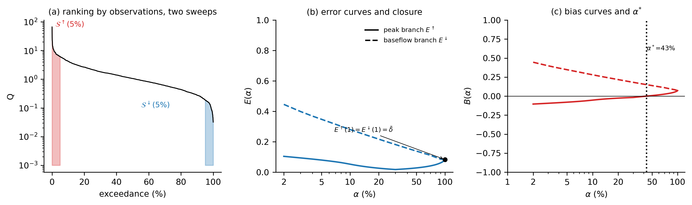
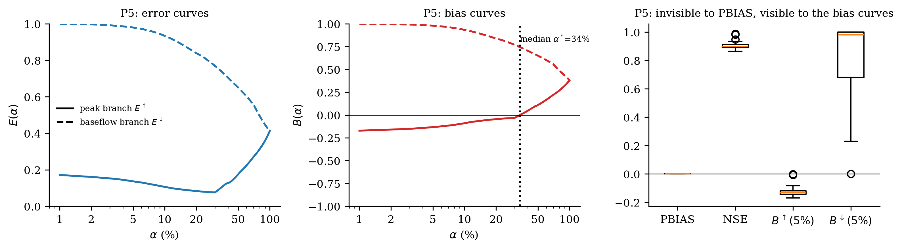
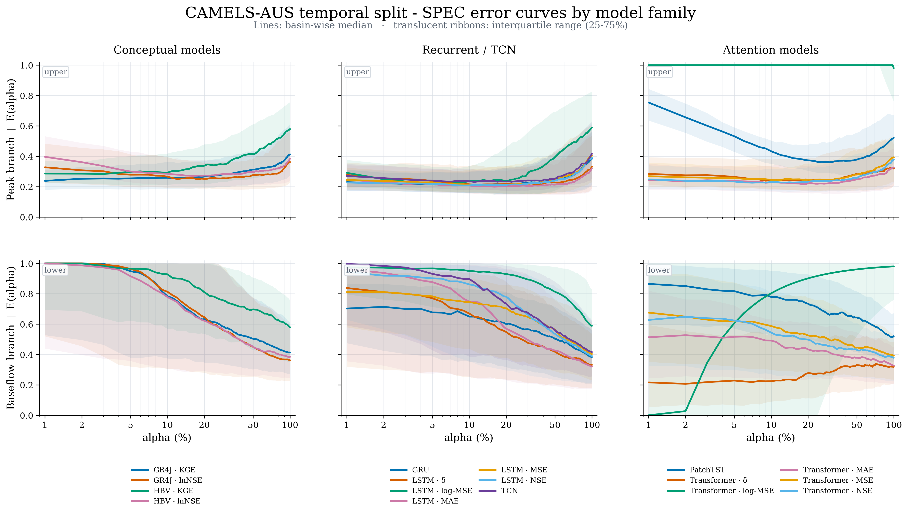
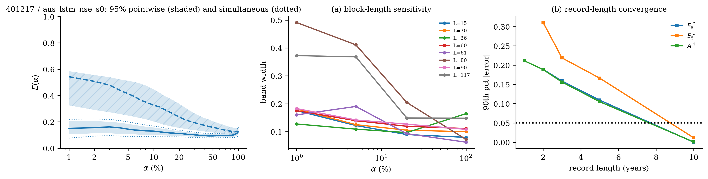

<div align="center">

# SPEC

### Symmetric Percentile Evaluation Curves for flow-resolved streamflow model evaluation

A reproducible research codebase for diagnosing **where** streamflow-model errors occur along the observed-flow distribution, **how large** they are, and **which direction** they accumulate.

<p>
  
  
  
  
</p>



</div>

---

## Overview

Most hydrological scores collapse an entire evaluation period into one number. SPEC instead ranks paired observations and simulations by **observed discharge** and performs two cumulative sweeps:

- **peak branch**: from the wettest observations toward the full record;
- **low-flow branch**: from the driest observations toward the full record.

The default pointwise discrepancy is bounded, symmetric, dimensionless, and explicitly defined at zero flow:

$$
\delta_i = \frac{|\hat y_i-y_i|}{|\hat y_i|+|y_i|},
\qquad
\beta_i = \frac{\hat y_i-y_i}{|\hat y_i|+|y_i|}.
$$

The cumulative error curves $E^{\uparrow}(\alpha)$ and $E^{\downarrow}(\alpha)$ describe error magnitude; the signed curves $B^{\uparrow}(\alpha)$ and $B^{\downarrow}(\alpha)$ describe error direction. At $\alpha=100\%$, the two branches close to the same whole-record bounded discrepancy.

### What this repository contains

- the reusable `spec/` implementation;
- stationary-block bootstrap and simultaneous uncertainty bands;
- alternative-kernel stress tests;
- controlled perturbations;
- conceptual and deep-learning benchmark implementations;
- E1--E8 experiment scripts from the supplied paper archive;
- curated numerical results and manuscript-level figures;
- unit tests for the core mathematical properties.

---

## Why SPEC?

SPEC is designed for situations in which similar whole-record scores can hide different error structures. The codebase explicitly separates:

1. **magnitude** -- how large the discrepancy is;
2. **direction** -- overprediction versus underprediction;
3. **location** -- where the discrepancy accumulates in the observed-flow distribution;
4. **persistence** -- whether a defect is confined to an extreme endpoint or persists over a broader percentile range;
5. **uncertainty** -- how much of the resolved structure is supported by the available record.

A controlled compensating-error example illustrates the motivation:

<p align="center">
  
</p>

---

## Method at a glance

For valid paired observations $\{(y_i,\hat y_i)\}_{i=1}^n$:

1. remove non-finite pairs jointly;
2. rank the pairs by **observed** discharge;
3. construct descending and ascending cumulative subsets;
4. compute running means of $\delta_i$ and $\beta_i$;
5. suppress cumulative segments with fewer than `min_m=30` pairs by default;
6. derive summaries such as branch areas $A^{\uparrow},A^{\downarrow}$, extreme values $E_5^{\uparrow},E_5^{\downarrow}$, and the first signed crossing $\alpha^*$;
7. optionally quantify uncertainty with stationary-block bootstrap, simultaneous bands, and paired model-difference bands.

The main public API is one line:

```python
from spec import spec
out = spec(y_obs, y_sim)
```

`out` contains the curves, derived summaries, marginal-density diagnostics, change points, and local sign entropy.

---

## Quick start

### Option A -- lightweight core install

```bash
git clone <YOUR-GITHUB-URL>
cd SPEC
pip install -e ".[dev]"
python -m pytest tests/test_core.py -q
python examples/quickstart.py
```

### Option B -- full research environment

```bash
conda env create -f environment.yml
conda activate spec
python -m pytest tests/test_core.py -q
```

The supplied archive passes all **9 core tests** covering boundedness, zero-flow behavior, exchange symmetry, scale invariance, the multiplicative-ratio identity, curve closure, bounded single-point influence, and minimum-segment suppression.

---

## Example

```python
import numpy as np
from spec import spec

rng = np.random.default_rng(7)
y_obs = rng.lognormal(0.0, 1.0, 1000)
y_sim = np.clip(y_obs * np.exp(rng.normal(0.0, 0.30, 1000)), 0.0, None)

result = spec(y_obs, y_sim)
print(result["summary"])
```

Useful summary keys include:

```text
A_up, A_lo,
E5_up, E5_lo,
B5_up, B5_lo,
alpha_star_up, alpha_star_lo,
delta_bar, beta_bar,
Delta_asym,
H_mean_up, H_mean_lo
```

---

## Experimental pipeline

The repository preserves the E1--E8 organization of the supplied research archive.

| Experiment | Question | Entry point | Curated outputs |
|---|---|---|---|
| **E1** | Can controlled error structures be distinguished? | `experiments/e1_perturbation.py` | `e1_identifiability.csv`, `e1_metrics.csv` |
| **E2** | Why use the bounded discrepancy at zero flow? | `experiments/e2_variants.py` | kernel definedness, CV, LOO influence, branch correlation |
| **E3** | How do model families differ across the flow distribution? | `experiments/e3_benchmark.py` | temporal/PUB summaries, ranking flips, Friedman tests |
| **E4** | What do the curves reveal at representative catchments? | `experiments/e4_case_studies.py` | cross-check table + 16 LSTM diagnostic panels |
| **E5** | How uncertain are extreme-percentile summaries? | `experiments/e5_uncertainty.py` | band widths, record-length convergence, paired inference |
| **E6** | How do training objectives redistribute error? | `experiments/e6_loss_ablation.py` | loss-ablation and Pareto summaries |
| **E7** | Which implementation choices matter? | `experiments/e7_robustness.py` | sensitivity summary + runtime |
| **E8** | Are flow-resolved features relevant to downstream decisions? | `experiments/e8_decision.py` | grouped-CV regression results |

See **[`docs/REPRODUCTION.md`](docs/REPRODUCTION.md)** for the complete command sequence.

---

## Selected experimental outputs

### Large-sample model profiles

<p align="center">
  
</p>

### Sampling uncertainty and record length

<p align="center">
  
</p>

The exact CSV outputs used to support these analyses are committed under [`results/`](results/). Large checkpoints, raw data, full prediction archives, and redundant intermediate reports are excluded from this GitHub release.

---

## Repository structure

```text
SPEC/
├── spec/                   # Core SPEC implementation
│   ├── core.py             # delta/beta, two branches, summaries, density, entropy
│   ├── bootstrap.py        # stationary-block bootstrap and simultaneous bands
│   ├── variants.py         # alternative discrepancy constructions
│   ├── perturb.py          # controlled perturbations / rating-curve noise
│   ├── metrics.py          # conventional hydrological metrics
│   ├── plotting.py         # diagnostic plotting helpers
│   ├── data.py             # CAMELS data loaders and preprocessing utilities
│   └── io.py               # prediction I/O
├── experiments/            # E1--E8 analysis scripts
├── models/
│   ├── conceptual/         # GR4J / HBV implementations and calibration
│   └── dl/                 # LSTM / GRU / Transformer / PatchTST / TCN
├── scripts/                # data preparation and experiment orchestration
├── tests/                  # core mathematical-property tests
├── examples/               # minimal executable example
├── results/                # curated numerical outputs
├── figures/                # curated paper-level figures
├── docs/                   # reproduction guide
└── data/README.md          # external-data setup
```

---

## Data

Raw hydrological data are **not redistributed** here.

The main benchmark uses **CAMELS-AUS v1**:

- data archive: https://doi.org/10.5281/zenodo.4784634
- dataset paper: https://doi.org/10.5194/essd-13-3847-2021

The included loader is configured for the per-basin CAMELS-AUS layout used by the supplied experiment archive. After preparing that layout, run:

```bash
export SPEC_DATA=/path/to/spec_data
python scripts/prepare_data.py
```

The source archive does not include a converter from the original Zenodo release layout. See [`data/README.md`](data/README.md) for the exact expected directory structure.

---

## Reproducibility notes

Several implementation choices are intentionally explicit because they change the statistical object being evaluated:

- **ranking is observation-defined** so every model is evaluated on the same dates;
- **zero flow is not stabilized with an arbitrary epsilon**: double zero maps to `0`, one-sided zero maps to `1`;
- **bootstrap resamples the paired series and reconstructs the ranking and cumulative segments inside each replicate**;
- **short extreme segments are suppressed** rather than interpreted from too few observations;
- **paired model comparison uses shared bootstrap resamples**;
- the `rank_by="sim"` and `rank_by="mean"` options exist for robustness experiments, not as interchangeable defaults.

These conventions are documented in the code and tested where appropriate.

---

## Citation

This bundle was prepared from the supplied research archive associated with the SPEC manuscript. The archive does not contain a final author list, journal DOI, or accepted-paper citation, so citation metadata have intentionally **not** been fabricated here.

Before public release, replace this paragraph with the final manuscript citation and, if desired, add a `CITATION.cff` file.

---

## License

The supplied source archive did not contain a software license. No license has been assigned automatically. Before making the repository public, add the license selected by the repository owner and remove `LICENSE_NOT_SET.md`.

---

## Acknowledgment

If you use this repository, please cite the corresponding SPEC manuscript and the underlying hydrological datasets used in your experiments.
